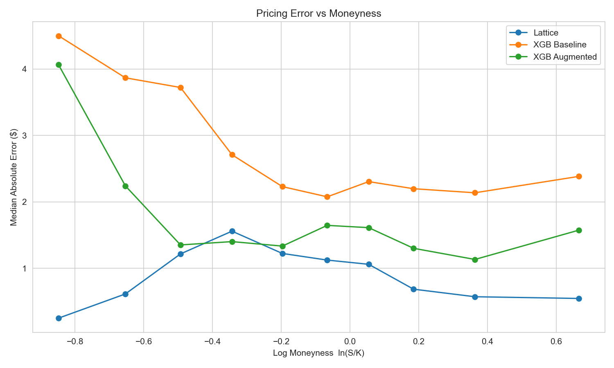
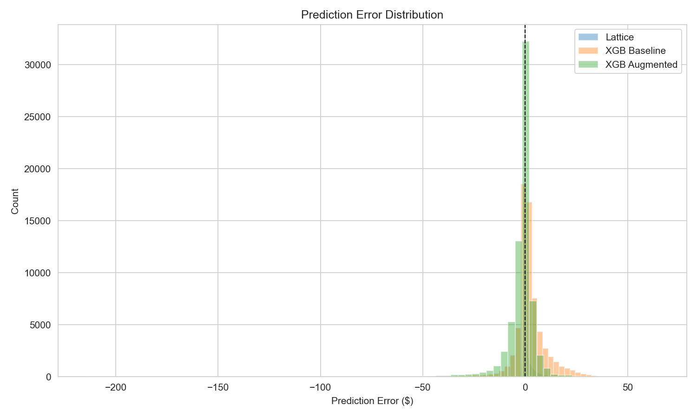
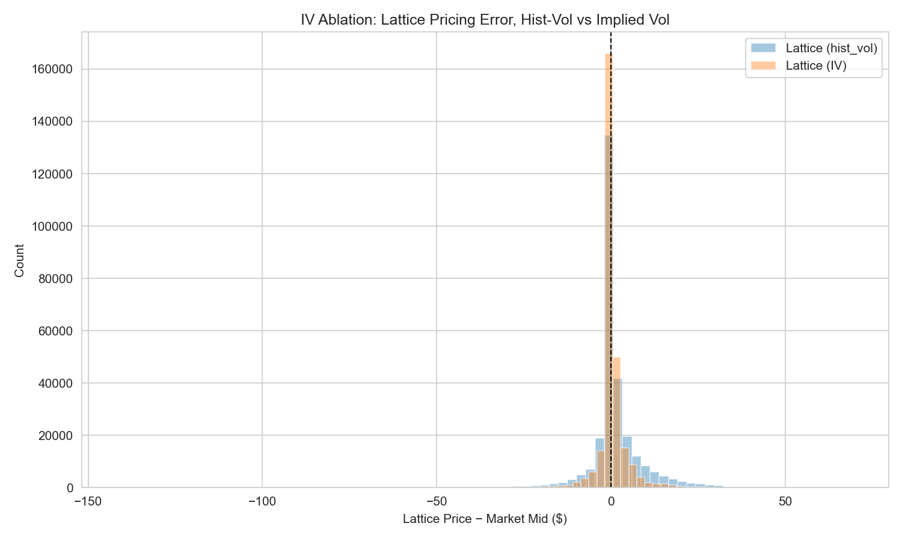

# NVDA American Option Pricing: Lattice vs XGBoost

This project prices American-style NVDA equity options (2021–2022) two ways — a
model-based binomial lattice that explicitly handles early exercise, and a
data-driven XGBoost regressor trained on observed option quotes — and compares
both against real market mid-prices to see whether structure or flexibility
wins, and where each one breaks.

---

## Headline Results

Test set: 66,966 option quotes, 2022‑07‑01 → 2022‑12‑30 (chronological holdout,
never seen during training).

| Model         | MAE ($) | RMSE ($) |
|---------------|--------:|---------:|
| Lattice       |  1.5308 |   2.8696 |
| XGB Baseline  |  5.3217 |   9.2325 |
| XGB Augmented |  3.9411 |   8.5514 |

MAPE is intentionally omitted: many test contracts are cheap, far-OTM options
with mid-prices near $0, so small absolute errors translate into enormous,
unstable percentage errors that don't reflect real pricing quality.

**Note the ordering:** the raw lattice price alone beats both XGBoost variants
on this test set. See [Known Issues](#known-issues) below — this is an open,
actively-investigated regression, not a typo.

---

## Figures







---

## Methodology

- **Data**: NVDA American equity option chains, 2021–2022, sourced from
  [OptionsDX](https://www.optionsdx.com/). Cleaned to quote date, strike,
  expiration, bid/ask, volume, and implied vol (`data_cleaner.py`).
- **Train/test split is chronological**, not random: train = quotes before
  2022‑07‑01 (233,034 rows), test = quotes on/after 2022‑07‑01 (66,966 rows).
  This avoids look-ahead bias — the model never trains on data from after the
  date it's evaluated on.
- **Lattice**: American binomial tree, `N=100` steps, priced on a fixed
  300,000-row sample (150k calls / 150k puts, sampled 2021‑01‑04 →
  2022‑12‑30) rather than the full cleaned dataset, for tractable runtime.
- **Risk-free rate**: flat `r = 0.04` proxy for the full 2021–2022 window —
  not a term structure, not fit per-date.
- **Volatility**: 30-day rolling historical volatility by default
  (`hist_vol`), computed from daily NVDA closes with the 2021‑07‑20 4-for-1
  split's artificial return masked out (see Key Findings).
- **Dividends**: not modeled. NVDA pays a small dividend; the lattice and BAW
  pricers here assume a non-dividend underlier.

---

## Key Findings

- **Split-vol contamination bug (fixed).** NVDA's 2021‑07‑20 4-for-1 split
  produces a ~‑140% one-day "return" in the raw underlying series. Left
  unmasked, this single day poisons every 30-day rolling historical-vol
  window that contains it, inflating `hist_vol` for weeks around the split.
  `src/features.py` now masks `|log_ret| >= 0.5` before computing the rolling
  window.
- **IV ablation confirms the error is mostly a volatility-input problem, not
  a pricing-model problem.** Re-pricing the same 279,649 valid-IV rows (93.2%
  of the 300k sample) with market-implied vol instead of historical vol
  roughly **halves** lattice error: hist-vol lattice MAE $4.3826 / RMSE
  $9.0491 vs IV-lattice MAE $1.9544 / RMSE $4.1760, both measured against
  market mid on the same rows. The lattice math is sound; the historical-vol
  *estimate* feeding it is the weaker link. See `src/iv_ablation.py` and
  `figures/iv_ablation_comparison.png`.
- **Put-call parity holds almost exactly inside the lattice** (self-consistency
  check, independent of market data): 96.33% of 31,127 matched call/put pairs
  fall within `[S-K, S-K·e^-rT]` using lattice prices, and the remaining
  "violations" are ~1e-12 in magnitude — floating-point noise, not real
  breaks. **Market mid-prices satisfy the same bound only 70.39% of the
  time** (29.61% violations, avg magnitude $5.13, max $564.34) — expected,
  since the theoretical bound assumes no dividend and NVDA pays one, and
  because market quotes include bid/ask noise and the same outlier strikes
  flagged below. See `src/parity_check.py` and
  `figures/put_call_parity_residuals.png`.
- **Lattice sample scaled to 300,000 rows** (150k calls / 150k puts) for this
  round of analysis, up from a smaller pilot sample used during initial
  development — full re-run comparison numbers from that earlier, smaller
  run were not preserved, so only the current 300k-row results are reported
  here.

---

## Known Issues

**XGB Augmented underperforms the raw lattice price it's supposed to
improve on, and both XGBoost variants show a heavy error tail.**

On the same 66,966-row test set:

| Model         | MAE ($) | RMSE ($) | RMSE / MAE |
|---------------|--------:|---------:|-----------:|
| Lattice       |  1.5308 |   2.8696 |       1.87 |
| XGB Baseline  |  5.3217 |   9.2325 |       1.74 |
| XGB Augmented |  3.9411 |   8.5514 |       2.17 |

Augmented does beat baseline (adding `lattice_price` as a feature helps), but
neither XGBoost model beats simply using the lattice price directly, and
`RMSE ≫ MAE` for all three — a signature of a small number of very large
misses dominating the squared-error metric rather than uniformly mediocre
predictions.

Diagnostic findings (`src/` diagnostic run, read-only, no pipeline changes):

- The worst 20 test-set errors (abs error $167–$214) are **all deep-ITM
  puts struck at $600**, against an underlying trading around $112–$146 —
  i.e. `log_moneyness` far beyond ±1.0. $600 was roughly NVDA's price level
  *before* the 2021‑07‑20 4-for-1 split; these look like legacy/thin strikes
  that shouldn't dominate a liquid-quotes sample.
- Of the worst 1% of test errors (670 rows), **91.9% are ITM** and **49.0%
  have >180 days to expiry** — long-dated, deep-ITM, likely-illiquid
  contracts are the dominant failure mode.
- The liquidity filters this project is meant to enforce do not appear to be
  fully applied in `src/features.py` — only a basic bad-quote removal
  (`mid > 0` and not `(volume == 0 and bid == 0)`) is implemented, with no
  explicit DTE, `|log_moneyness|`, or spread/mid cutoff. On the current
  300k-row sample: min DTE = 1.0 day, max `|log_moneyness|` = 3.65, max
  `bid_ask_spread / mid` = 2.0, with 8,349 rows at DTE < 2, 27,776 rows at
  `|log_moneyness| > 1.0`, and 30,530 rows at `spread/mid > 0.5`.

**Leading theories** (not yet confirmed):

1. The unfiltered deep-ITM/long-dated/wide-spread outliers above are getting
   into training and disproportionately driving squared-error loss, pulling
   the model away from fitting the bulk of liquid, near-the-money contracts.
2. `src/xgb_model.py` currently trains both models with
   `early_stopping_rounds=30` against `eval_set=[(X_test, y_test)]` — i.e.
   the test set itself picks the best boosting round. This isn't full label
   leakage, but it is a form of test-set-informed model selection worth
   revisiting.
3. Whatever regression appeared "at scale" may simply be the outlier count
   growing in step with the 300k-row sample size, rather than a scale effect
   in the modeling approach itself.

This is being tracked as a separate, ongoing investigation — `src/xgb_model.py`
was intentionally not modified in this pass.

---

## Limitations

- Lattice pricing here uses flat historical volatility by default, not
  implied vol — see the IV ablation above for how much this costs in
  accuracy.
- No dividend modeling anywhere in the pipeline; NVDA pays a small dividend.
- Single ticker (NVDA) — findings may not generalize to other names,
  especially ones without a stock split in the sample window.
- The 2021–2022 window contains NVDA's 4-for-1 split (2021‑07‑20) plus a
  sharp 2022 bear-market drawdown — an unusually volatile regime, not
  necessarily representative of "typical" market conditions.
- The lattice is priced on a fixed 300,000-row sample, not the full cleaned
  dataset, for runtime reasons.

---

## Reproduction

1. Get the raw data from [OptionsDX](https://www.optionsdx.com/) (paid,
   licensed — **not redistributed in this repo**; see `data/README.md`).
2. `python data_cleaner.py` to produce `nvda_cleaned_2021_2022.csv`.
3. `pip install -r requirements.txt`
4. `make all` — runs features → lattice pricing → XGBoost training →
   evaluation figures.
   - `make smoke` — quick binomial/trinomial/Black-Scholes sanity check.
   - `python src/iv_ablation.py` — IV ablation (Task 1 above).
   - `python src/parity_check.py` — put-call parity check (Task 2 above).

---

## Repository Structure

```text
.
├── binomial.py                    # binomial/trinomial/BAW American pricers
├── data_cleaner.py                # raw OptionsDX CSV -> cleaned 2021-2022 CSV
├── Makefile
├── requirements.txt
├── src/
│   ├── features.py                # feature engineering, hist_vol, split-day fix
│   ├── lattice_pricer.py          # prices a sample with the lattice, saves CSV
│   ├── xgb_model.py                # trains baseline/augmented XGBoost
│   ├── evaluation.py               # generates the 5 core comparison figures
│   ├── iv_ablation.py              # re-prices with IV instead of hist_vol
│   └── parity_check.py             # put-call parity no-arbitrage check
├── data/
│   ├── README.md                   # how to obtain/regenerate the data (not tracked)
│   ├── nvda_with_lattice.csv       # gitignored — regenerate via make
│   ├── nvda_test_predictions.csv   # gitignored — regenerate via make
│   └── nvda_lattice_iv_ablation.csv# gitignored — regenerate via iv_ablation.py
├── models/
│   └── xgb_augmented.json          # tracked (< 1 MB)
└── figures/
    ├── error_vs_moneyness.png
    ├── error_vs_maturity.png
    ├── error_histograms.png
    ├── feature_importance.png
    ├── scatter_lattice_vs_market.png
    ├── iv_ablation_comparison.png
    └── put_call_parity_residuals.png
```
